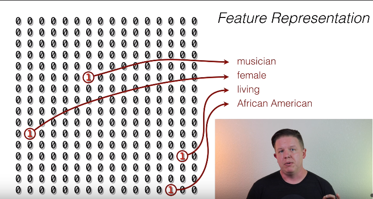
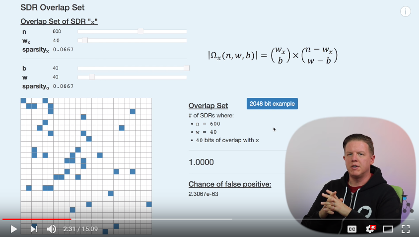

# Episode 0 - HTM Overview

## Neocortex 

* 75% of brain
* evolved in mamals for the past 100-200 Million of years
* in humans the size of the NC is comparable to a dinner napkin
* "Seed of Intelligence in the Brain"

The structure of NC is pretty much the same in all its regions, like for audio, video, language, ...

The problem solving algorithm is similar for each task no matter the input.

## Hierarchy

* Lower level: Input from Ear, Eye, ...
* Higher levels: take input from lower levels which is more abstract
* each node in each level uses the same algorithm

Example:

1. Lower Level: Edges of object
2. Higher Level: Shape recognition
3. Even higher level: Object recognition
4. Even even higher level: Associations with idea activities

Each Neocortex region has a similar hierarchy and uses the same algorithm!

## Neurons

* Human's NC have 20-30 Billion Neurons
* State of NC at any time is defined by number of active neurons
* usually a very small percentage is active (~2%)

## SDR - Sparse Distribution Representation

* Bit-array with on/off neurons
* represents neurons of a region in NC

## I/O of NC

1. Motor commands (output to muscles)
2. Sensory input (touch, smell, taste, sight, ...)

`1. + 2. = Model of the World (from NC point of view)`

## Sensory Encoders

Input (GPS coordinates, temperature) converted to SDRs

## Temporal Sequence Memory

* an algorithm which learns pattern overtime

## Online Learning

* no training data
* contigeous learning
* constantly adapting to changes in the world
* predictive model is created

# Episode 1: Bit Arrays

## Data structure

* 8bits can store 256 different values (capacity)

## Operations

* OR: more ones in the result
* AND: 
* NOT: aka exclusive OR
* Population: How many ones? 1101 = 3; aka Hamming Weight

## Sparsity vs Density

Dense: 50% on
Sparse: 2% on (e.g 4 bits in 256 bit array)

How many representations of 4bits can be found in 256bit array? -> ~175 Million
(see below)

## Feature Representation

## Compression

An array with random bits with a 50% change to be on or off, cannot be compressed.

Sparse representations can be significantly compressed by storing only the index. E.g. a 256 bits array with 4 bits on can stored with 4 integers, like [86,161,171, 201]. If each index is uint_8 it would fit in an uint_32.

# Episode 2: SDR Capacity & Comparison

Elements of the data structure:

* n - array length -- 256
* w - population -- 5
* sparsity (density) - w / n -- 0.0195
* capacity - "n choose w" - (n!) / (w!*(n-w)!) -- 8,809,549,056

## Capacity

Capacity is the number of values that can be stored in a bit array.

HTM's use bit arrays of length from 2048 bits up to 65,536 bits.

## SDR Comparison

Overlap: bits that are on in 2 arrays at the same position, aka AND operation.

Union: bits that are on in 2 arrays, aka OR operation

Compare: simple comparison with highlighting overlaps

Overlap score: Number of bits shared.

## SDR Matching

SDR's are noise tolerant.

Two SDRs are matching if a threshold (theta) of the overlap score is at certain value or higher. If theta is lower than the SDRs are not matching.

Theta is used to set the noise tolerance. If theta is low than noise tolerance is high.

False Positive is the percentage if a match is incorrect.

# Episode 3: Overlap Sets and Subsampling

## Neurons and SDRs

Neuron:

* Complex Pattern Recognition System
* Receives constant stream of SDRs
* Based in the input (SDRs) the neuron decides if itself "fires" or not
* If it "fires" the neuron will turn ot own bit on. At another SDR

SDR:

* Every bit represents one neuron

## SDR Overlap Set (@ 2:25min)

The Overlap Set for a SDR x is the number of SDRs that have the same n, specific w, with a specific Number Of Bits Overlap (b) with an SDR x.

On-Bit Space: w_x choose b
Off-Bit Space: (n-w_x) choose (w-b)

False Positive: Overlap Set / Capacity

## SDR Subsampling (@ 8:25)

A subsampled SDR doesn't have all bits on than its original. But the on bits are the same as in the original.

When an SDR is saved with only indices the subsampled one is smaller.

SDRs are very fault tolerant. There is no need to store all bits!

Matching a subsampled SDR with a random SDR is almost as successful (accurate) as matching with the original.

# Episode 4: Sets & Unions

## SDR Classification 

* Stacks of SDRs
* Selecting one SDR and matching with all others in the stack
* Comparison Curve is very steep (@ 5:25min)

* Very expensive operation, to compare one SDR with all others.
* Better is to create a Union of the stack

## SDR Unions

* OR operation
* Matching with Union SDR has a high probability of false positive

# Episode 5: Scalar Encoding

# Episode 6: 

# Episode 7: [Spatial Pooling - Input Space & Connections](https://www.youtube.com/watch?v=R5UoFNtv5AU)

Modeled after NC. The NC is composed of hierarchies of regions

## Spatial Pooling

Input Space --> SP Algorithm --> Active SP Columns

## Goals Of Spatial Pooling

1. Maintain a fixed sparsity
2. Maintain Overlap Properties
    ??? e.g. For two similar inputs the SP must generate two similar outputs ??? 

## Input Space

An input space is collection of SDRs of certain bit length. Each SDR represents data of an instance in such space. The input space is likely to be huge (10^100 or more). 

The SDR can be subdivided into several sections (buckets of bits) which represent different data streams. E.g.

1. Bits 0 - 199: Power Consumption
2. Bits 200 - 399: Time of Day
3. Bits 400 - 599: Weekday

## SP initialization to a specific input space

A SP is a collection of "columns". Each column has a relationship to each bit in the input space, called a pool of potential connections.

The number of (potential) connections is a parameter when the SP is initialized. It's represented by a percentage, e.g. 85% of all bits from the input space.

Each connection has a permanence attached to it. @10:10min

* white cells -> column will never connect to this bit
* red cells -> very low permanence (0.1), hence column is not connected to this bit
* yellow cells -> medium permanence
* green cells -> strong permanence

A connection threshold defines the permanence which enables a connection.

By definition the SP will keep a certain number of connections even if the connection threshold is high. Depends on a distribution function which narrows or widens based on the input parameters.

For a specific SDR each SP column is connected to a set ON bits in the SDR and also connected to set of OFF bits. The number of ON bits is called the overlap score. If the number exceeds a certain threshold the column is part of Active columns. @18:20min

For each SDR being pushed through a SP a set of active columns will be generated. Such set of active cells can then be compared to other sets of active cells and similarities (e.g. overlap score) can be determined. For instance, if 10% of active cells matches to another set the two SDR's might be related.

### SP Parameters

1. Potential Percentage: Percentage of connections to input space
2. Synaptic Permanence Connected (Connection Treshold): Percentage of permanence needed to make a connection.

# Episode 8: 

# Episode 9: 

# Episode 10: 
